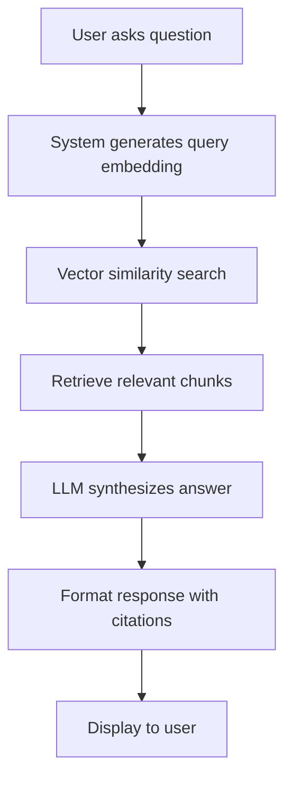
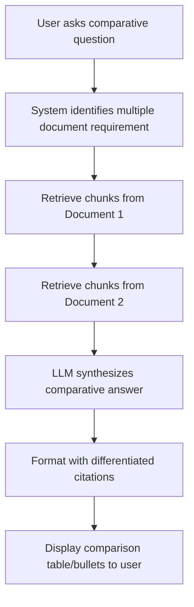
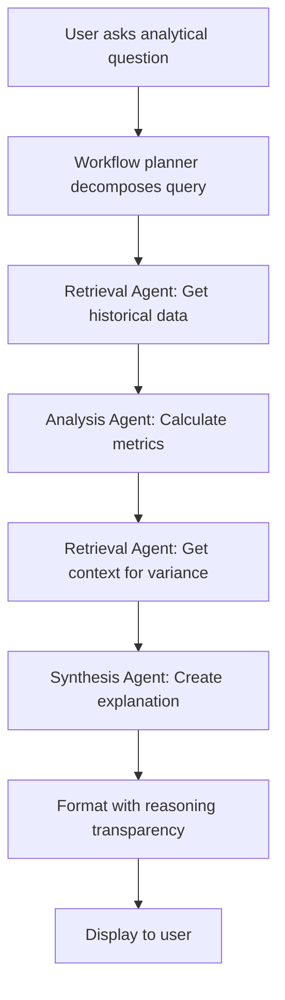
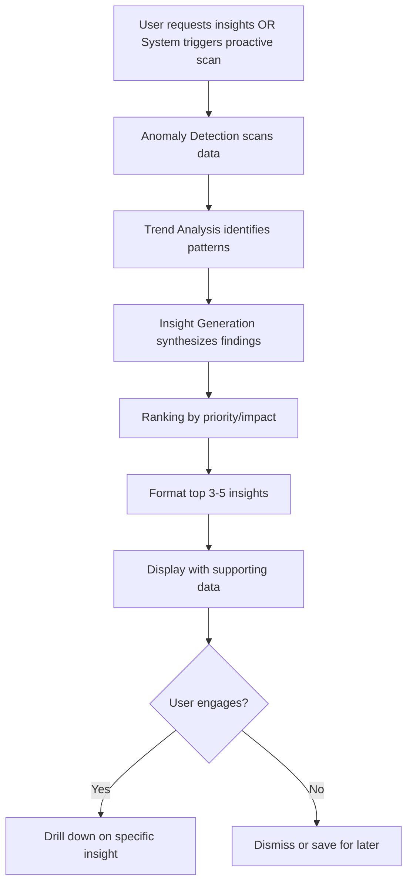
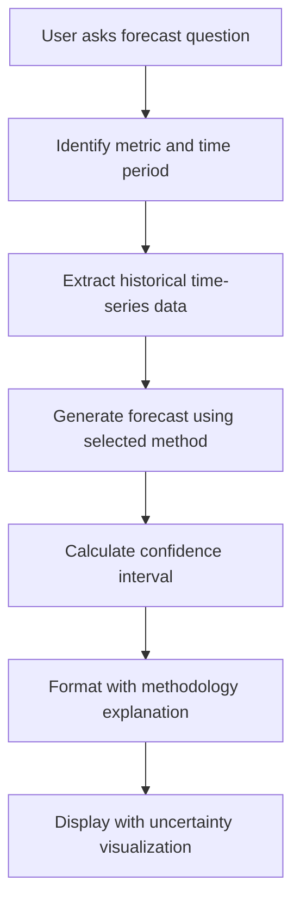

# RAGLite MCP Response Format & Interaction Patterns Specification

---

## Introduction

This document defines the conversational interaction patterns, response format specifications, and user experience guidelines for RAGLite's MCP (Model Context Protocol) interface. Since RAGLite has no custom UI and operates entirely through MCP-compatible clients (Claude Desktop initially), this specification ensures consistent, user-centered responses that deliver financial intelligence through natural language conversation.

### Change Log

| Date | Version | Description | Author |
|------|---------|-------------|--------|
| 2025-10-03 | 1.0 | Initial MCP interaction specification | Sally (UX Expert) |

---

## Overall UX Goals & Principles

### Target User Personas

**Primary Persona - Financial Analyst:**
- Finance team members who spend 40-60% of their time manually searching through PDFs and Excel spreadsheets
- Need quick, accurate answers to stakeholder questions about financial performance
- Value time savings and decision quality over learning new tools
- Expect professional, analytical tone and verifiable sources

**Secondary Persona - Finance Leader:**
- Senior finance professionals making strategic decisions
- Need proactive insights and trends, not just answers to questions
- Limited time for deep document analysis
- Require high confidence in data accuracy and attribution

**Future Persona - Team Collaborator (Post-MVP):**
- Multiple team members accessing shared financial intelligence
- Need consistent, reliable answers across team
- Value collaboration features and shared insight discovery

### Usability Goals

1. **Instant Comprehension:** Users ask questions in plain language without learning query syntax - natural conversation eliminates learning curve
2. **Trust Through Verification:** Every answer includes verifiable source attribution (95%+ accuracy) enabling users to validate critical information
3. **Efficient Discovery:** 80% reduction in time-to-insight (hours/days → minutes) through conversational access to comprehensive knowledge base
4. **Progressive Complexity:** Simple queries get simple answers (2-3 paragraphs); complex analysis revealed through follow-up questions
5. **Proactive Value:** System surfaces insights users should know, not just what they ask - 75%+ rated useful/actionable

### Design Principles

1. **Clarity over cleverness** - Prioritize clear, professional financial communication over conversational personality
2. **Source attribution by default** - Every factual claim must include verifiable document reference
3. **Progressive disclosure** - Show only what's needed, when it's needed; complex workflows execute invisibly
4. **Immediate, transparent feedback** - Users understand what the system is doing (retrieving, analyzing, forecasting) and why
5. **Fail gracefully with guidance** - Errors provide alternative questions or explain what's missing, never dead-ends

---

## Conversational Flow Patterns

### User Flow: Simple Factual Query

**User Goal:** Get specific financial information quickly

**Entry Points:** User asks direct question in MCP client (e.g., "What was Q3 revenue?")

**Success Criteria:** User receives accurate answer with source citation in <5 seconds

**Flow Diagram:**



**Edge Cases & Error Handling:**
- **Ambiguous query:** System asks clarification ("Which quarter did you mean? Q3 2023 or Q3 2024?")
- **No relevant data found:** System explains what's missing and suggests alternatives
- **Multiple valid answers:** System presents options or asks for specificity

**Notes:** This is the most common flow (60-70% of queries). Response format must be concise and citation-forward.

---

### User Flow: Multi-Document Synthesis

**User Goal:** Compare information across multiple time periods or entities

**Entry Points:** User asks comparative question (e.g., "Compare Q2 vs Q3 marketing spend")

**Success Criteria:** User receives clear comparison with sources for each data point

**Flow Diagram:**



**Edge Cases & Error Handling:**
- **Missing document:** System indicates which comparison is incomplete and explains why
- **Inconsistent metrics:** System flags and explains discrepancies across documents
- **Too many entities:** System limits to top 3-5 most relevant or asks user to narrow scope

**Notes:** Response must clearly differentiate sources for each data point. Consider using structured formats (tables, bullet comparisons) for clarity.

---

### User Flow: Complex Analytical Workflow (Agentic)

**User Goal:** Get multi-step analysis requiring reasoning and calculation

**Entry Points:** User asks analytical question (e.g., "Calculate YoY revenue growth and explain variance")

**Success Criteria:** User receives comprehensive analysis with reasoning steps visible in <30 seconds

**Flow Diagram:**



**Edge Cases & Error Handling:**
- **Workflow timeout:** Fallback to simpler retrieval with partial answer
- **Agent failure:** Graceful degradation with error explanation
- **Data gaps:** Identify what's missing and explain impact on analysis

**Notes:** Users should see what the system is doing ("Analyzing Q3 2023 data...", "Calculating variance...") for transparency. If workflow fails, provide partial results rather than complete failure.

---

### User Flow: Proactive Insight Discovery

**User Goal:** Learn what's important without knowing what to ask

**Entry Points:** User requests insights (e.g., "What should I know about Q3?" or system volunteers insights)

**Success Criteria:** User receives 3-5 prioritized insights with supporting data and 75%+ rated useful

**Flow Diagram:**



**Edge Cases & Error Handling:**
- **No significant insights:** Confirm all metrics are within expected ranges rather than "nothing to report"
- **Overwhelming insights:** Limit to top 5, allow filtering by category (risks, opportunities, anomalies)
- **False positives:** Provide context to help user validate insight relevance

**Notes:** Insights should be actionable ("Focus on X because Y") not just informational. Include confidence indicators for predictions.

---

### User Flow: Forecast Query

**User Goal:** Understand predicted future performance

**Entry Points:** User asks predictive question (e.g., "What's the revenue forecast for Q4?")

**Success Criteria:** User receives forecast with confidence interval and methodology explanation

**Flow Diagram:**



**Edge Cases & Error Handling:**
- **Insufficient historical data:** Explain minimum data requirements and provide available partial forecast
- **High uncertainty:** Clearly communicate wide confidence intervals and reasons
- **Forecast update needed:** Indicate when forecast was last updated and if new data is available

**Notes:** Always include confidence interval (e.g., "±15%") and explain basis ("based on 6 months historical trend"). Forecasts should feel like informed predictions, not guarantees.

---

## Response Format Structures

### Response Format: Simple Factual Answer

**Purpose:** Deliver concise, accurate information with verifiable sources

**Structure:**
```
[2-3 paragraph synthesized answer addressing the query directly]

**Sources:**
- [Document Name], page [X], [Section Name]
- [Additional sources if multi-document]
```

**Example:**
```
Q3 2024 revenue was $6.2M, representing a 15% increase from Q2 2024 ($5.4M).
The primary drivers were increased enterprise contract renewals (up 25%) and
new customer acquisitions in the healthcare vertical.

The revenue breakdown shows: Enterprise segment $4.1M (66%), SMB segment $1.8M
(29%), and Professional Services $0.3M (5%).

**Sources:**
- Q3_2024_Financial_Report.pdf, page 3, Revenue Summary section
- Q3_2024_Financial_Report.pdf, page 8, Segment Analysis table
```

**Key Requirements:**
- Answer the question in first paragraph
- Provide relevant context/details in subsequent paragraphs
- Maximum 3 paragraphs (concise over comprehensive)
- Source attribution must include: document name, page number, section name
- Use bullet points for sources if multiple documents
- Financial figures always include units ($, %, etc.)

---

### Response Format: Multi-Document Comparison

**Purpose:** Clearly compare information across documents/time periods

**Structure:**
```
[1-2 paragraph summary of comparison highlighting key findings]

**Comparison:**
| Metric | [Period 1] | [Period 2] | Change |
|--------|------------|------------|--------|
| [Metric 1] | [Value] | [Value] | [+/- %] |
| [Metric 2] | [Value] | [Value] | [+/- %] |

[1 paragraph explaining variance or patterns]

**Sources:**
- [Period 1]: [Document Name], page [X], [Section]
- [Period 2]: [Document Name], page [X], [Section]
```

**Example:**
```
Marketing spend increased 30% from Q2 to Q3 2024 ($800K to $1.04M), but revenue
only grew 15%, suggesting potential efficiency concerns worth investigating.

**Comparison:**
| Metric | Q2 2024 | Q3 2024 | Change |
|--------|---------|---------|--------|
| Marketing Spend | $800K | $1.04M | +30% |
| Revenue | $5.4M | $6.2M | +15% |
| Customer Acquisition Cost | $1,200 | $1,850 | +54% |

The disproportionate increase in CAC suggests that while marketing spend increased,
conversion efficiency declined. Q3 campaigns focused on new vertical expansion which
typically has higher initial acquisition costs.

**Sources:**
- Q2 2024: Q2_Financial_Report.pdf, page 12, Marketing Analysis section
- Q3 2024: Q3_Financial_Report.pdf, page 15, Marketing Metrics table
```

**Key Requirements:**
- Lead with comparison summary (what's most important)
- Use tables for numerical comparisons (3-5 rows maximum)
- Include percentage changes or deltas in comparison
- Explain variance/patterns after presenting data
- Differentiated source citations per data point

---

### Response Format: Analytical Workflow Result

**Purpose:** Show multi-step analysis with transparent reasoning

**Structure:**
```
[1-2 paragraph executive summary of analysis findings]

**Analysis Process:**
1. [Step 1 description] → [Result]
2. [Step 2 description] → [Result]
3. [Step 3 description] → [Result]

**Key Findings:**
- [Finding 1 with supporting data]
- [Finding 2 with supporting data]
- [Finding 3 with supporting data]

**Interpretation:** [1-2 paragraphs explaining what findings mean and why they matter]

**Sources:**
- [List all documents/sections used across workflow steps]
```

**Example:**
```
YoY revenue growth from Q3 2023 to Q3 2024 was 45% ($4.3M to $6.2M), driven
primarily by enterprise segment expansion and improved retention rates.

**Analysis Process:**
1. Retrieved Q3 2023 revenue: $4.3M → Found in historical reports
2. Retrieved Q3 2024 revenue: $6.2M → Current quarter data
3. Calculated growth rate: ($6.2M - $4.3M) / $4.3M = 44.2% ≈ 45%
4. Analyzed variance drivers → Enterprise +65%, SMB +15%, Services +10%

**Key Findings:**
- Enterprise segment grew 65% YoY ($2.5M to $4.1M) - primary growth driver
- Customer retention improved from 88% to 93% - reduced churn impact
- New customer acquisition up 40% - expansion into healthcare vertical

**Interpretation:** The exceptional growth is sustainable based on strong enterprise
pipeline (3.2x coverage for Q4) and improved retention metrics. However, SMB growth
is lagging and may require focused attention in 2025 planning.

**Sources:**
- Q3_2023_Financial_Report.pdf, page 3, Revenue Summary
- Q3_2024_Financial_Report.pdf, page 3, Revenue Summary
- Q3_2024_Financial_Report.pdf, page 8, Segment Analysis
- Q3_2024_Financial_Report.pdf, page 22, Customer Metrics
```

**Key Requirements:**
- Executive summary first (busy users may not read full analysis)
- Numbered analysis steps show reasoning transparency
- Key findings as bullets (scannable, actionable)
- Interpretation explains business impact, not just math
- Comprehensive source list covering all workflow steps

---

### Response Format: Proactive Insight

**Purpose:** Surface strategic insights requiring attention

**Structure:**
```
**[Insight Category]: [Concise headline describing the insight]**

[1-2 paragraphs explaining the insight with supporting data and context]

**Impact:** [Severity/Priority level] - [Why this matters for business]

**Recommended Action:** [Specific next step or area to investigate]

**Supporting Data:**
- [Data point 1 with source]
- [Data point 2 with source]
```

**Example:**
```
**🚨 Risk Alert: Cloud Infrastructure Costs Trending 40% Over Budget**

Cloud infrastructure spending in Q3 2024 reached $420K against a budgeted $300K,
representing a 40% overrun. The trend has accelerated over the past 3 months
(July: +15%, August: +28%, September: +40%) while user growth only increased 12%
in the same period, suggesting inefficient resource allocation.

**Impact:** High Priority - If trend continues, FY2024 will exceed budget by $480K
and impact EBITDA margins by 3 percentage points.

**Recommended Action:** Conduct immediate infrastructure audit focusing on: (1) unused
compute resources in production environment, (2) data storage optimization opportunities,
(3) review of auto-scaling configurations.

**Supporting Data:**
- Q3 actual spend: $420K vs budget $300K (+40%) - Q3_Financial_Report.pdf, page 18
- Monthly trend: July +15%, Aug +28%, Sept +40% - Monthly_Expense_Tracker.xlsx
- User growth: 12% in Q3 - Q3_Product_Metrics.pdf, page 4
```

**Key Requirements:**
- Lead with category and compelling headline (risk/opportunity/anomaly)
- Use emoji indicators sparingly for severity (🚨 high risk, ⚠️ moderate, 💡 opportunity)
- Impact statement must quantify business consequence
- Recommended action must be specific and actionable
- Supporting data bullets with inline citations

---

### Response Format: Forecast Response

**Purpose:** Provide predictions with uncertainty and methodology transparency

**Structure:**
```
**Forecast: [Metric] for [Time Period]**

**Predicted Value:** [Value] ± [Confidence Interval]

[1-2 paragraphs explaining forecast basis and key assumptions]

**Forecast Methodology:**
- **Approach:** [LLM-based / Statistical / Hybrid]
- **Historical Data:** [Time range and data points used]
- **Confidence Level:** [High/Medium/Low] - [Reasoning]

**Key Assumptions:**
- [Assumption 1]
- [Assumption 2]

**How to Verify:** [Guidance on validating forecast when actuals available]

**Sources:**
- [List historical documents used for forecast]
```

**Example:**
```
**Forecast: Q4 2024 Revenue**

**Predicted Value:** $7.1M ± $1.1M (range: $6.0M - $8.2M)

Based on 6-month historical trend analysis, Q4 2024 revenue is forecasted at $7.1M,
representing 15% sequential growth from Q3. The forecast incorporates seasonal patterns
(Q4 historically 10-20% stronger due to enterprise year-end purchasing) and current
pipeline coverage of 2.8x target.

**Forecast Methodology:**
- **Approach:** Hybrid (Statistical trend + LLM pipeline analysis)
- **Historical Data:** Q1 2023 - Q3 2024 (7 quarters)
- **Confidence Level:** Medium - Wide range due to macro uncertainty and new vertical expansion

**Key Assumptions:**
- Enterprise pipeline converts at historical 35% rate
- No major customer churn events (retained top 10 customers)
- Healthcare vertical (new in Q3) contributes $500K-$800K
- Macro environment remains stable (no recession impact)

**How to Verify:** Compare against Q4 actuals when available in January 2025. Track
pipeline conversion rates weekly to validate assumption 1.

**Sources:**
- Historical revenue: Q1_2023 through Q3_2024 financial reports
- Pipeline data: Q3_2024_Sales_Pipeline.xlsx
- Seasonal patterns: FY2023_Annual_Report.pdf, page 34
```

**Key Requirements:**
- Lead with clear prediction and confidence interval (± value)
- Explain forecast basis in plain language
- Methodology transparency (approach, data, confidence reasoning)
- Assumptions must be testable/observable
- Verification guidance enables user to validate later
- Wide confidence intervals acceptable if uncertainty is high (honest prediction > false precision)

---

## Error Handling & Edge Case Patterns

### Error Pattern: Ambiguous Query

**Trigger:** Query lacks specificity (time period, entity, or metric unclear)

**User Experience:** System asks clarifying question rather than guessing

**Response Format:**
```
I need clarification to provide an accurate answer:

**Your question:** "[User's original query]"

**What I need to know:**
- [Clarifying question 1] (e.g., "Which quarter did you mean?")
- [Clarifying question 2 if applicable]

**Suggestions:** [Provide 2-3 example specific questions they could ask]
```

**Example:**
```
I need clarification to provide an accurate answer:

**Your question:** "What was the marketing spend?"

**What I need to know:**
- Which time period? (Q1, Q2, Q3, or Q4 2024?)
- Which marketing category? (Digital, Events, Content, or Total?)

**Suggestions:**
- "What was Q3 2024 total marketing spend?"
- "Compare Q2 vs Q3 2024 digital marketing spend"
- "Show all Q3 2024 marketing categories"
```

**Key Requirements:**
- Never guess when ambiguous - always ask
- Repeat user's question to confirm understanding
- Provide specific examples of how to rephrase
- Limit clarifying questions to 2-3 (not overwhelming)

---

### Error Pattern: No Relevant Data Found

**Trigger:** Vector search returns no relevant chunks OR required document missing

**User Experience:** Explain what's missing and suggest alternatives

**Response Format:**
```
I couldn't find information to answer your question.

**What I searched for:** [Interpretation of user's query]

**Why no results:**
- [Reason 1: e.g., "No documents contain Q4 2024 data yet"]
- [Reason 2: e.g., "The metric you asked about isn't tracked in available documents"]

**What you can do:**
- [Alternative 1: e.g., "Try asking about Q3 2024 instead"]
- [Alternative 2: e.g., "I can show you related metrics: [list]"]

**Available data:** [Brief summary of what IS available that's related]
```

**Example:**
```
I couldn't find information to answer your question.

**What I searched for:** Q4 2024 revenue forecasts

**Why no results:**
- Q4 2024 hasn't completed yet, so no actual revenue data is available
- Forecast data for Q4 hasn't been generated (requires historical trend analysis setup)

**What you can do:**
- Ask about Q3 2024 actual revenue instead
- I can analyze Q1-Q3 2024 revenue trends to discuss likely Q4 patterns
- Request a revenue forecast (this will trigger forecast generation if data is sufficient)

**Available data:** I have complete financial data through Q3 2024, including revenue,
expenses, and segment performance across all quarters of 2024.
```

**Key Requirements:**
- Be specific about what's missing (don't just say "no data")
- Explain WHY data isn't available (timing, scope, etc.)
- Provide actionable alternatives (2-3 options)
- Show what IS available to help user pivot

---

### Error Pattern: Insufficient Historical Data (Forecast/Trend)

**Trigger:** User requests forecast/trend but insufficient data points exist

**User Experience:** Explain data requirements and provide partial analysis if possible

**Response Format:**
```
I cannot generate a reliable [forecast/trend analysis] due to insufficient historical data.

**Requirements:**
- **Needed:** [X data points / Y time periods]
- **Available:** [What we actually have]
- **Gap:** [What's missing]

**Partial Analysis Available:**
[Provide whatever analysis IS possible with available data]

**How to improve:**
- [Action to get better results, e.g., "Add historical documents from 2023"]
- [Timeline info, e.g., "After 2 more quarters, forecasting will be more reliable"]
```

**Example:**
```
I cannot generate a reliable revenue forecast due to insufficient historical data.

**Requirements:**
- **Needed:** Minimum 6 quarters of revenue data for seasonal pattern analysis
- **Available:** 3 quarters (Q1-Q3 2024)
- **Gap:** Missing 3+ quarters of historical data

**Partial Analysis Available:**
Based on available Q1-Q3 2024 data, I can observe:
- Sequential growth averaging 12% per quarter
- Q3 showed acceleration to 15% growth vs Q2
- Enterprise segment driving majority of growth (60%+ contribution)

**How to improve:**
- Add 2023 financial reports to enable year-over-year analysis and seasonal patterns
- After Q4 2024 completes (4 quarters total), I can provide directional forecasts
- For now, I can extrapolate simple trend: Q4 likely $6.8-7.4M if Q3 growth continues
```

**Key Requirements:**
- Be transparent about minimum data requirements
- Show exactly what's missing (numerical gap)
- Provide whatever partial analysis IS possible (don't just refuse)
- Give roadmap to better results (what data to add, when it'll improve)

---

### Error Pattern: Conflicting Information

**Trigger:** Multiple sources provide contradictory information

**User Experience:** Flag conflict, present all versions with sources, explain discrepancy if possible

**Response Format:**
```
⚠️ I found conflicting information across documents.

**Your question:** "[User's query]"

**Conflicting Data:**
- **Version 1:** [Value/statement] (Source: [Document], page [X])
- **Version 2:** [Value/statement] (Source: [Document], page [X])

**Possible reasons for discrepancy:**
- [Reason 1, e.g., "Different time periods or calculation methods"]
- [Reason 2, e.g., "One may be preliminary, other final"]

**Recommendation:** [Suggest which version to trust or how to resolve]
```

**Example:**
```
⚠️ I found conflicting information across documents.

**Your question:** "What was Q3 2024 marketing spend?"

**Conflicting Data:**
- **Version 1:** $1.04M (Source: Q3_Financial_Report.pdf, page 15)
- **Version 2:** $980K (Source: Q3_Budget_Variance.xlsx, Marketing tab)

**Possible reasons for discrepancy:**
- Budget variance report may show budgeted amount ($980K) vs. actual spend ($1.04M)
- Timing difference: report dated Oct 15, variance sheet dated Sept 30
- Different expense categorization (some costs may be allocated differently)

**Recommendation:** The official financial report ($1.04M) is likely the authoritative
actual spend. The variance sheet shows you exceeded budget by $60K (+6%). Verify with
the document dates and confirm if $980K was the budget vs. $1.04M actual.
```

**Key Requirements:**
- Use warning indicator (⚠️) to flag conflicts
- Present ALL conflicting versions with equal prominence
- Provide sources for each version
- Hypothesize WHY conflict exists (help user resolve)
- Recommend most authoritative source when possible

---

### Error Pattern: Agentic Workflow Failure

**Trigger:** Multi-step workflow times out or agent fails

**User Experience:** Graceful degradation with partial results or simpler answer

**Response Format:**
```
⚠️ Complex analysis workflow encountered an issue. Providing simplified response instead.

[Simpler retrieval-based answer to original question]

**What happened:**
- Attempted: [Description of complex workflow that failed]
- Issue: [Brief explanation of failure]
- Fallback: [Explanation of simpler approach used]

**Limited scope:**
[Note any limitations of the simplified response vs. intended analysis]

**Try instead:** [Suggest simpler question or manual approach]
```

**Example:**
```
⚠️ Complex analysis workflow encountered an issue. Providing simplified response instead.

Q3 2024 revenue was $6.2M, up 15% from Q2 ($5.4M). Enterprise segment contributed
$4.1M (66% of total), SMB $1.8M (29%), and Services $0.3M (5%).

**What happened:**
- Attempted: Multi-step variance analysis comparing Q2 vs Q3 with driver decomposition
- Issue: Analysis agent timeout after 30 seconds during variance calculation step
- Fallback: Retrieved basic revenue data using direct search instead

**Limited scope:**
This response includes revenue figures but lacks the detailed variance driver analysis
(why enterprise grew 25%, SMB only 10%, etc.) that the full workflow would provide.

**Try instead:**
- Ask specific questions: "Why did enterprise revenue grow in Q3?"
- Manual analysis: Review Q3 report pages 8-12 for segment details
- Retry workflow: Complex analysis may succeed on retry or with narrower scope
```

**Key Requirements:**
- Always provide SOME answer (never complete failure)
- Explain what was attempted and why it failed
- Be transparent about limitations of fallback response
- Offer alternatives (retry, manual approach, narrower question)
- Log failures for system improvement

---

### Error Pattern: LLM API Failure

**Trigger:** LLM synthesis fails (API error, timeout, rate limit)

**User Experience:** Return raw retrieved chunks with sources, explain synthesis unavailable

**Response Format:**
```
⚠️ Answer synthesis temporarily unavailable. Showing raw document excerpts instead.

**Relevant excerpts from documents:**

**Excerpt 1:**
[Raw chunk text from document]
(Source: [Document], page [X], [Section])

**Excerpt 2:**
[Raw chunk text from document]
(Source: [Document], page [X], [Section])

**Note:** I retrieved relevant information but couldn't synthesize it into a cohesive
answer due to a temporary processing issue. Please review the excerpts above, or retry
your question in a moment.
```

**Example:**
```
⚠️ Answer synthesis temporarily unavailable. Showing raw document excerpts instead.

**Relevant excerpts from documents:**

**Excerpt 1:**
"Q3 2024 total revenue reached $6.2M, representing 15% sequential growth from Q2.
Enterprise segment performance exceeded expectations with $4.1M contribution..."
(Source: Q3_Financial_Report.pdf, page 3, Executive Summary)

**Excerpt 2:**
"YoY comparison shows 45% growth from Q3 2023 ($4.3M) to Q3 2024 ($6.2M), primarily
driven by enterprise contract renewals and healthcare vertical expansion..."
(Source: Q3_Financial_Report.pdf, page 7, Year-over-Year Analysis)

**Note:** I retrieved relevant information but couldn't synthesize it into a cohesive
answer due to a temporary processing issue. Please review the excerpts above, or retry
your question in a moment.
```

**Key Requirements:**
- Provide the retrieved data even without synthesis
- Clearly mark as "raw excerpts" not polished answer
- Include full source attribution for each excerpt
- Suggest retry after brief wait
- Log failures for monitoring/debugging

---

## Accessibility Requirements

### MCP Client Responsibility

**Level: N/A for Custom UI** - RAGLite has no custom interface; accessibility is handled by MCP-compatible clients (Claude Desktop, etc.)

**RAGLite's Accessibility Contribution:**

While we don't control the visual presentation, RAGLite ensures responses are inherently accessible:

1. **Text-Native Responses**
   - All responses are plain text or markdown (no visual-only content)
   - No reliance on color, images, or visual formatting to convey meaning
   - Screen readers can process all response content without loss of information

2. **Structured, Scannable Content**
   - Clear headings (**bold** for sections like "Sources:", "Key Findings:")
   - Bulleted lists for scannable information
   - Tables use proper markdown structure with headers
   - Semantic hierarchy maintained (summary → details → sources)

3. **Clear Language & Terminology**
   - Professional but plain language (avoiding unnecessary jargon)
   - Financial terms used appropriately for domain (not oversimplified)
   - Abbreviations explained on first use in context (e.g., "YoY (Year-over-Year)")
   - Numbers formatted with clear units ($, %, dates)

4. **Alternative Text Approach**
   - No images/charts in MVP responses (text-only)
   - Mermaid diagrams in spec documentation only (not runtime responses)
   - Future: If visualizations added, ensure text equivalents provided

5. **Cognitive Accessibility**
   - Concise responses (max 3 paragraphs for simple queries)
   - Progressive disclosure (simple answer first, details follow)
   - Clear error messages with actionable next steps
   - Consistent response formats reduce cognitive load

### Future Considerations (Custom Web UI Post-MVP)

If custom UI is built, ensure:
- WCAG 2.1 Level AA compliance minimum
- Keyboard navigation for all interactive elements
- Color contrast ratios 4.5:1 for text, 3:1 for UI components
- Focus indicators visible and high-contrast
- Form labels and ARIA attributes for dynamic content

---

## Performance Considerations

### Response Time Targets (from PRD)

**Critical Performance Goals:**

| Query Type | p50 Target | p95 Target | Notes |
|------------|------------|------------|-------|
| Simple factual query | <5 seconds | <10 seconds | Direct retrieval + synthesis |
| Multi-document synthesis | <8 seconds | <15 seconds | Multiple vector searches |
| Complex analytical workflow | <20 seconds | <30 seconds | Multi-agent orchestration |
| Forecast generation | <10 seconds | <20 seconds | Historical data extraction + prediction |
| Proactive insights | <15 seconds | <30 seconds | Anomaly detection + trend analysis |

### UX Impact of Performance

**Response Time Psychology:**

- **<2 seconds:** Feels instant, ideal for simple queries
- **2-5 seconds:** Acceptable, maintain user engagement with "thinking" indicator
- **5-10 seconds:** Requires feedback - show progress ("Retrieving data...", "Analyzing...")
- **10-30 seconds:** Critical threshold - must show detailed progress or risk abandonment
- **>30 seconds:** Workflow timeout - graceful degradation to simpler response

**Performance-Driven UX Patterns:**

1. **Progressive Response Delivery**
   - For long-running workflows, consider streaming partial results
   - Show retrieval results first, then analysis, then synthesis
   - User sees value immediately, full answer builds progressively

2. **Transparent Processing Indicators**
   - Simple queries: No indicator needed if <3 seconds
   - Complex workflows: Show steps ("Step 1/4: Retrieving Q3 data...")
   - Agentic workflows: Indicate which agent is active ("Analysis Agent calculating...")

3. **Caching Strategy** (for Architect)
   - Cache frequent queries (e.g., "What was Q3 revenue?")
   - Cache embeddings for common query patterns
   - Invalidate cache on document updates

4. **Graceful Degradation on Timeout**
   - 30-second hard timeout for workflows
   - Return partial results with explanation rather than complete failure
   - Offer retry or simplified alternative

### Design Decisions for Performance

**Conciseness Drives Speed:**
- 3-paragraph maximum for simple answers (less LLM token generation)
- Limit comparison tables to 5 rows (focused, faster to generate)
- Top 3-5 insights only (not exhaustive lists)

**Structured Formats Optimize Processing:**
- Consistent response templates reduce LLM "thinking" time
- Bullet points faster to generate than narrative paragraphs
- Tables pre-structured (less formatting decisions for LLM)

**Source Attribution Placement:**
- Sources at end of response (doesn't slow initial answer delivery)
- Allows synthesis to complete before citation lookup in some architectures

---

## Next Steps

### Immediate Actions

1. **Design Handoff to Architect**
   - Architect reviews this spec during architecture design phase
   - UX patterns inform MCP response formatting implementation
   - Error handling patterns guide robustness requirements

2. **Architect Incorporates UX Requirements**
   - Response format templates implemented as prompt engineering patterns
   - Error handling logic maps to graceful degradation architecture (NFR32)
   - Performance targets drive database/API optimization decisions

3. **Development Implementation**
   - MCP tool responses follow specified formats
   - Error patterns implemented in exception handling
   - Performance monitoring tracks p50/p95 against targets

### Design Handoff Checklist

- [x] All user flows documented with entry points and success criteria
- [x] Response format structures defined with examples
- [x] Error handling patterns comprehensive (6 core scenarios)
- [x] Accessibility approach documented (text-native, screen-reader friendly)
- [x] Performance considerations tied to PRD targets
- [x] UX principles established (clarity, attribution, transparency, graceful failure)

### Open Questions for Architect

1. **Response Streaming:** Can MCP protocol support progressive response delivery for long workflows?
2. **Client Capabilities:** Do all MCP clients render markdown tables correctly? Fallback format needed?
3. **Caching Strategy:** What query/response caching is feasible within MCP architecture?
4. **Progress Indicators:** How to communicate workflow progress through MCP (if supported)?
5. **Confidence Levels:** Numerical (85%) vs. Qualitative (High/Medium/Low) for forecast confidence?

### Success Criteria for UX Validation

**MVP User Acceptance (from PRD):**

- ✅ **User satisfaction:** 8/10+ rating for accuracy and usefulness
- ✅ **Retrieval accuracy:** 90%+ validated on test query set
- ✅ **Source attribution:** 95%+ accuracy verified
- ✅ **Performance:** <5 sec typical, <30 sec workflows met
- ✅ **Adoption:** System used for 90%+ of financial queries (replaces manual methods)
- ✅ **Insight quality:** 75%+ of proactive insights rated useful/actionable

**Ongoing Measurement:**

- User query patterns (what questions are asked most)
- Error rate tracking (which error patterns occur most)
- Performance monitoring (p50/p95 response times by query type)
- Follow-up question rate (indicates clarity of initial response)

---

## Document Summary

### What This Spec Defines

**Conversational UX for RAGLite Financial Intelligence:**

1. **Interaction Paradigms** - How users converse with RAGLite through MCP
2. **User Flows** - 5 core flows from simple queries to proactive insights
3. **Response Formats** - Structured templates for 5 response types with examples
4. **Error Handling** - 6 comprehensive error patterns with graceful degradation
5. **Accessibility** - Text-native, screen-reader friendly approach
6. **Performance** - UX-informed performance targets and optimization strategies

### What Happens Next

**For the Architect:**
- Use this spec to inform MCP response formatting in architecture design
- Map error patterns to system robustness requirements
- Design for performance targets with UX impact in mind
- Consider caching, streaming, and progress indication capabilities

**For Development:**
- Implement response format templates as prompt engineering patterns
- Build error handling logic per specified patterns
- Instrument performance monitoring for p50/p95 tracking
- Validate responses against format specifications

**For Product Validation:**
- Test user flows with real financial queries
- Measure satisfaction, accuracy, performance against success criteria
- Iterate on response formats based on user feedback
- Track error patterns for continuous improvement

---

*🤖 Generated with [Claude Code](https://claude.com/claude-code)*

*Co-Authored-By: Claude <noreply@anthropic.com>*
