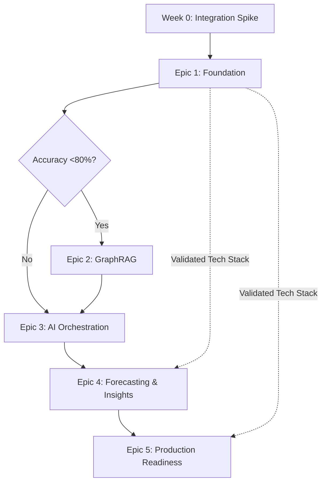

# Epic Alignment Matrix

**Project:** RAGLite - AI-Powered Financial Document Analysis
**Version:** 1.0
**Date:** 2025-10-12
**Author:** Sarah (Product Owner)
**Purpose:** Map epics to components, files, and architecture sections for complete traceability

---

## Overview

This matrix provides complete traceability from PRD epics to implementation components, ensuring every epic has clear architecture coverage and implementation path.

**Total Epics:** 5
**Coverage:** 100% (all epics have implementation paths)
**Architecture Completeness:** 80% (Epic 3 needs architecture specification)

---

## Epic-to-Component Master Matrix

| Epic | Phase | Components | Files | Stories | Architecture Refs | Status |
|------|-------|-----------|-------|---------|------------------|--------|
| **1: Foundation** | Phase 1 | Ingestion, Retrieval, MCP Server, Shared | 15 files | 14 stories | arch/3, 5, 6, 7, 8 | **In Progress** (21%) |
| **2: Advanced Docs** | Phase 2 | GraphRAG (conditional) | 3-4 files | TBD | arch/2, 5, 7, 8 | Conditional (<80% accuracy) |
| **3: AI Orchestration** | Phase 3 | Agentic Workflows | 4-5 files | TBD | **NEEDS ARCHITECTURE** | Architecture Incomplete |
| **4: Forecasting** | Phase 3 | Forecasting, Insights | 3 files | TBD | arch/3, 5 | Planned |
| **5: Production** | Phase 4 | AWS Infrastructure, Monitoring | Terraform, CloudWatch | TBD | arch/9, monitoring, security, cicd | Planned |

---

## Epic 1: Foundation & Accurate Retrieval

**Goal:** Working conversational financial Q&A system with 90%+ retrieval accuracy

**Phase:** Phase 1 (Weeks 1-5)
**Status:** IN PROGRESS - 21% complete (3/14 stories)
**Current Work:** Story 1.2 (PDF Ingestion)

### Component Breakdown

#### 1.1 Ingestion Module

**Purpose:** Document processing (PDF, Excel) with chunking and embedding generation

**Component:** `raglite/ingestion/`

**Files:**
- `raglite/ingestion/__init__.py` (~5 lines) - Module initialization
- `raglite/ingestion/pipeline.py` (~100 lines) - Main ingestion pipeline
  - Docling PDF extraction
  - openpyxl + pandas Excel extraction
  - Document metadata extraction
  - Chunking orchestration
  - Embedding generation orchestration
- `raglite/ingestion/contextual.py` (~50 lines) - Contextual Retrieval chunking
  - LLM-generated context per chunk
  - 98.1% retrieval accuracy enhancement

**Architecture References:**
- `arch/3-repository-structure-monolithic.md:18-20` - Module structure
- `arch/5-technology-stack-definitive.md:5-8` - Docling, openpyxl, pandas, Fin-E5
- `arch/6-complete-reference-implementation.md` - Coding patterns
- `arch/8-phased-implementation-strategy-v11-simplified.md:30-37` - Week 1 implementation

**Stories Mapping:**
- Story 1.2: PDF Document Ingestion with Docling (IN PROGRESS)
- Story 1.3: Excel Document Ingestion
- Story 1.4: Document Chunking & Semantic Segmentation
- Story 1.5: Embedding Model Integration & Vector Generation

**NFRs:**
- NFR2: <5 min processing for 100-page PDFs (Week 0: 4.28 min ✅)
- NFR9: 95%+ table extraction accuracy (Docling: 97.9% ✅)
- NFR27: Data quality validation during ingestion

**Dependencies:**
- Docling 2.55.1 (PDF extraction)
- sentence-transformers 5.1.1 (Fin-E5 embeddings)
- openpyxl + pandas (Excel processing)

---

#### 1.2 Retrieval Module

**Purpose:** Vector search, answer synthesis, source attribution

**Component:** `raglite/retrieval/`

**Files:**
- `raglite/retrieval/__init__.py` (~5 lines) - Module initialization
- `raglite/retrieval/search.py` (~50 lines) - Qdrant vector similarity search
  - Query embedding generation
  - Top-k retrieval from Qdrant
  - Result ranking and filtering
- `raglite/retrieval/synthesis.py` (DEPRECATED - Claude Code synthesizes)
  - **Architecture Change:** MCP tools return raw chunks
  - Claude Code (LLM client) synthesizes answers from chunks
- `raglite/retrieval/attribution.py` (~50 lines) - Source citation generation
  - Citation formatting: (Source: doc.pdf, page 12, Revenue section)
  - Multi-source citation handling

**Architecture References:**
- `arch/3-repository-structure-monolithic.md:22-26` - Module structure
- `arch/5-technology-stack-definitive.md:9-12` - Qdrant, Claude API
- `arch/6-complete-reference-implementation.md` - Coding patterns
- `arch/7-data-layer.md` - Qdrant configuration
- `arch/8-phased-implementation-strategy-v11-simplified.md:39-46` - Week 2 implementation

**Stories Mapping:**
- Story 1.6: Qdrant Vector Database Setup & Storage
- Story 1.7: Vector Similarity Search & Retrieval
- Story 1.8: Source Attribution & Citation Generation
- Story 1.11: Enhanced Chunk Metadata & MCP Response Formatting

**NFRs:**
- NFR5: Sub-5s retrieval performance (Week 0: 0.83s ✅)
- NFR6: 90%+ retrieval accuracy (Week 5 target)
- NFR7: 95%+ source attribution accuracy
- NFR13: <5s query response (p50), <15s (p95)

**Dependencies:**
- qdrant-client 1.15.1
- sentence-transformers 5.1.1 (query embeddings)

---

#### 1.3 MCP Server

**Purpose:** Expose RAG capabilities via Model Context Protocol

**Component:** `raglite/main.py`

**Files:**
- `raglite/main.py` (~200 lines) - FastMCP server entrypoint
  - Server initialization with lifespan management
  - Tool definitions:
    - `ingest_financial_document(doc_path: str)` → DocumentMetadata
    - `query_financial_documents(query: str, top_k: int)` → QueryResponse
    - `forecast_kpi()` [Phase 3]
    - `generate_insights()` [Phase 3]
  - MCP protocol compliance
  - Error handling and logging

**Architecture References:**
- `arch/2-executive-summary.md:46-54` - MCP Tools Layer diagram
- `arch/5-technology-stack-definitive.md:11` - FastMCP 1.x (MCP Python SDK)
- `arch/6-complete-reference-implementation.md:1-21` - Complete reference implementation
- `arch/8-phased-implementation-strategy-v11-simplified.md:48-54` - Week 3 implementation

**Stories Mapping:**
- Story 1.9: MCP Server Foundation & Protocol Compliance
- Story 1.10: Natural Language Query Tool (MCP)

**NFRs:**
- NFR30: MCP protocol compliance
- NFR31: Claude Desktop integration
- NFR32: Structured tool responses

**Dependencies:**
- fastmcp 2.12.4 (MCP Python SDK)
- pydantic (data models)

---

#### 1.4 Shared Utilities

**Purpose:** Common configuration, logging, models, clients

**Component:** `raglite/shared/`

**Files:**
- `raglite/shared/__init__.py` (~5 lines) - Module initialization
- `raglite/shared/config.py` (~30 lines) - Settings management ✅ DONE (Story 1.1)
  - Pydantic BaseSettings
  - Environment variable loading
  - Configuration validation
- `raglite/shared/logging.py` (~20 lines) - Structured logging setup ✅ DONE (Story 1.1)
  - JSON log formatting
  - Context injection (extra={})
  - Log level configuration
- `raglite/shared/models.py` (~30 lines) - Pydantic data models ✅ DONE (Story 1.1)
  - DocumentMetadata
  - QueryRequest
  - QueryResponse
  - QueryResult (chunk with metadata)
- `raglite/shared/clients.py` (~20 lines) - API client initialization ✅ DONE (Story 1.1)
  - Qdrant client factory
  - Claude API client (if needed)
  - Connection pooling

**Architecture References:**
- `arch/3-repository-structure-monolithic.md:37-42` - Module structure
- `arch/6-complete-reference-implementation.md` - Coding patterns
- `docs/qa/gates/1.1-project-setup-development-environment.yml` - QA validation

**Stories Mapping:**
- Story 1.1: Project Setup & Development Environment ✅ DONE (100% complete)

**NFRs:**
- NFR13: Secrets via env vars/secrets manager
- NFR14: Audit logging (structured logging)
- NFR17: Pluggable embedding models (abstraction in clients)
- NFR19: Swappable vector database (Qdrant client abstraction)

**Dependencies:**
- pydantic 2.x (data validation)
- pydantic-settings (config management)

---

#### 1.5 Testing

**Purpose:** Unit, integration, and accuracy validation tests

**Component:** `raglite/tests/`

**Files:**
- `raglite/tests/__init__.py` (~5 lines)
- `raglite/tests/conftest.py` (~50 lines) - pytest fixtures ✅ PARTIAL (Story 1.1 - 14/14 tests passing)
- `raglite/tests/test_ingestion.py` (~50 lines) - Ingestion pipeline tests
- `raglite/tests/test_retrieval.py` (~50 lines) - Retrieval and search tests
- `raglite/tests/test_synthesis.py` (~30 lines) - [DEPRECATED - synthesis in Claude Code]
- `raglite/tests/ground_truth.py` (~200 lines) - Accuracy validation
  - 50+ Q&A pairs (Story 1.12A, Week 1)
  - Automated accuracy measurement
  - Daily tracking capability
- `raglite/tests/fixtures/sample_financial_report.pdf` - Test document

**Architecture References:**
- `arch/3-repository-structure-monolithic.md:44-50` - Test structure
- `arch/testing-strategy.md` - Testing pyramid (80% unit, 15% integration, 5% E2E)
- `arch/8-phased-implementation-strategy-v11-simplified.md:62-69` - Week 5 validation

**Stories Mapping:**
- Story 1.12A: Ground Truth Test Set Creation (Week 1)
- Story 1.12B: Continuous Accuracy Tracking & Final Validation (Week 5)
- Plus unit/integration tests for Stories 1.2-1.11

**NFRs:**
- NFR6: 90%+ retrieval accuracy validation
- NFR7: 95%+ source attribution accuracy validation
- Test coverage: 80%+ target

**Dependencies:**
- pytest 8.4.2
- pytest-asyncio (async test support)

---

### Epic 1 Summary

**Total Files:** 15 files (~600-800 lines)
- Ingestion: 3 files (~155 lines)
- Retrieval: 3 files (~105 lines)
- MCP Server: 1 file (~200 lines)
- Shared: 5 files (~105 lines) ✅ DONE
- Tests: 3+ files (~200+ lines) ✅ PARTIAL

**Stories:** 14 total (0.0, 0.1, 1.1-1.12B)
- ✅ Complete: 3 (Story 0.0, 0.1, 1.1)
- 🔄 In Progress: 1 (Story 1.2)
- 📋 Planned: 10 (Stories 1.3-1.12B)

**Architecture Coverage:** 100% ✅
- Repository structure: Complete
- Technology stack: Complete
- Reference implementation: Complete
- Phased strategy: Complete

**Readiness:** 21% (Phase 1 Week 0-1 progress)

---

## Epic 2: Advanced Document Understanding

**Goal:** Multi-document synthesis with knowledge graph (conditional on Phase 1 accuracy)

**Phase:** Phase 2 (Weeks 5-8) - CONDITIONAL
**Status:** CONDITIONAL - Triggered only if Phase 1 accuracy <80%
**Trigger:** End of Phase 1 Week 5 validation

### Component Breakdown

#### 2.1 Knowledge Graph Module (CONDITIONAL)

**Purpose:** Entity extraction, graph construction, hybrid retrieval

**Component:** `raglite/graph/` (if needed)

**Files (Conditional):**
- `raglite/graph/__init__.py` (~5 lines)
- `raglite/graph/extraction.py` (~100 lines) - Entity and relationship extraction
  - Financial entities: companies, departments, metrics, KPIs, time periods
  - Relationship detection: correlations, dependencies, hierarchies
- `raglite/graph/construction.py` (~80 lines) - Neo4j graph construction
  - Graph schema design
  - Cypher query generation
  - Node and edge creation
- `raglite/graph/hybrid_retrieval.py` (~70 lines) - Vector + graph hybrid search
  - Combine vector similarity with graph traversal
  - Multi-hop query handling
  - Relational reasoning

**Architecture References:**
- `arch/2-executive-summary.md:23-25` - Phased Graph Approach (conditional)
- `arch/5-technology-stack-definitive.md:10` - Neo4j 5.x
- `arch/7-data-layer.md` - Neo4j integration patterns
- `arch/8-phased-implementation-strategy-v11-simplified.md:98-102` - Phase 2 decision gate

**Stories Mapping:**
- TBD - Stories created IF Phase 1 accuracy <80%

**NFRs:**
- NFR6: 90%+ retrieval accuracy (GraphRAG enhancement)
- FR6-FR8: Entity extraction, graph construction, hybrid retrieval

**Dependencies:**
- neo4j 5.x (graph database driver)
- Additional: LLM for entity extraction

**Decision Gate:**
- ✅ **SKIP Phase 2:** IF Phase 1 accuracy ≥90% (target met)
- ⚠️ **CONSIDER Phase 2:** IF Phase 1 accuracy 80-89% (acceptable, defer)
- 🛑 **REQUIRE Phase 2:** IF Phase 1 accuracy <80% DUE TO multi-hop query failures

---

#### 2.2 Retrieval Enhancements

**Purpose:** Integrate graph traversal with vector search

**Component:** `raglite/retrieval/` (enhancements)

**Files (Conditional):**
- `raglite/retrieval/hybrid_search.py` (~60 lines) - Orchestrate vector + graph
  - Query analysis (vector-only vs hybrid)
  - Result fusion and ranking
  - Performance optimization

**Architecture References:**
- `arch/2-executive-summary.md:23-25` - Conditional GraphRAG
- `arch/8-phased-implementation-strategy-v11-simplified.md:89-91` - Root cause analysis

**Stories Mapping:**
- TBD - Depends on Phase 1 decision gate

**NFRs:**
- NFR13: Maintain <5s (p50), <15s (p95) response times with graph

---

### Epic 2 Summary

**Total Files:** 3-4 files (~300-350 lines) - CONDITIONAL
**Status:** Conditional - Implementation depends on Phase 1 accuracy
**Decision Timeline:** End of Phase 1 Week 5
**Architecture Coverage:** 100% (conditional architecture complete)

---

## Epic 3: AI Intelligence & Orchestration

**Goal:** Multi-step reasoning and complex analytical workflows through agentic orchestration

**Phase:** Phase 3 (Weeks 9-12 OR 5-8 if Epic 2 skipped)
**Status:** ARCHITECTURE INCOMPLETE - Needs design before implementation
**Blocker:** Framework selection pending (LangGraph/Bedrock/function calling)

### Component Breakdown

#### 3.1 Agentic Orchestration Module (ARCHITECTURE NEEDED)

**Purpose:** Multi-agent workflows for complex analytical tasks

**Component:** `raglite/orchestration/` (ARCHITECTURE NEEDED)

**Files (Estimated):**
- `raglite/orchestration/__init__.py` (~5 lines)
- `raglite/orchestration/agents.py` (~150 lines) - Agent definitions
  - **MISSING:** Agent types (retrieval, analysis, forecasting, synthesis)
  - **MISSING:** Agent responsibilities and interfaces
  - **MISSING:** Agent communication patterns
- `raglite/orchestration/workflows.py` (~100 lines) - Workflow execution
  - **MISSING:** Orchestration patterns (sequential, parallel, conditional)
  - **MISSING:** State management approach
  - **MISSING:** Workflow routing logic
- `raglite/orchestration/state.py` (~80 lines) - State management
  - **MISSING:** State persistence strategy
  - **MISSING:** State transitions
- `raglite/orchestration/fallback.py` (~50 lines) - Error handling
  - **MISSING:** Graceful degradation strategies
  - **MISSING:** Fallback to simpler retrieval

**Architecture References:**
- **MISSING:** Epic 3 architecture specification
- **PENDING:** Framework selection (LangGraph vs Bedrock vs function calling)
- `PRD/requirements.md:FR14-FR17` - Functional requirements defined
- `PRD/epic-3-ai-intelligence-orchestration.md` - Epic goal defined

**Stories Mapping:**
- TBD - Stories created AFTER architecture complete

**NFRs:**
- NFR5: <30s complex workflow completion
- FR14: Multi-step analytical workflows
- FR15: Specialized agents
- FR16: Complex workflow execution
- FR17: Workflow failure handling with fallback

**Dependencies:**
- **PENDING:** Framework selection
  - Option 1: LangGraph (agent framework with state graphs)
  - Option 2: AWS Bedrock Agents (managed agentic service)
  - Option 3: Direct function calling (Claude API native)

**Critical Gap:** Architecture specification needed before implementation.

**Recommendation:**
1. **Research Spike (2-3 days):** Evaluate framework options
2. **Architecture Design (3-4 days):** Agent types, orchestration patterns, state management
3. **Create Tech Spec:** `docs/tech-spec-epic-3.md`
4. **Timeline:** Before Phase 3 start (after Phase 1 Week 5 validation)

---

### Epic 3 Summary

**Total Files:** 4-5 files (~400-450 lines estimated) - ARCHITECTURE NEEDED
**Status:** Architecture incomplete
**Blocker:** Framework selection and architecture design
**Architecture Coverage:** 0% (needs Epic 3 architecture section)

---

## Epic 4: Forecasting & Proactive Insights

**Goal:** Predictive intelligence and strategic recommendations

**Phase:** Phase 3 (Weeks 9-12 OR 5-8 if Epic 2 skipped)
**Status:** PLANNED - Architecture complete, implementation pending
**Prerequisites:** Epic 1 complete (data ingestion and retrieval working)

### Component Breakdown

#### 4.1 Forecasting Module

**Purpose:** Time-series forecasting for financial KPIs

**Component:** `raglite/forecasting/`

**Files:**
- `raglite/forecasting/__init__.py` (~5 lines)
- `raglite/forecasting/hybrid.py` (~100 lines) - Prophet + LLM forecasting
  - Prophet baseline model (statistical forecasting)
  - LLM-based adjustment (context-aware refinement)
  - Confidence interval calculation
  - Forecast update on new documents

**Architecture References:**
- `arch/3-repository-structure-monolithic.md:28-30` - Module structure
- `arch/5-technology-stack-definitive.md:13` - Prophet 1.1+
- `PRD/epic-4-forecasting-proactive-insights.md` - Epic requirements

**Stories Mapping:**
- TBD - Stories created during Phase 3 planning

**NFRs:**
- NFR10: ±15% forecast accuracy
- FR18: Financial forecasting (revenue, cash flow, expenses)
- FR19: Forecast confidence intervals
- FR20: Auto-update forecasts on new docs
- FR21: Custom KPI forecasting

**Dependencies:**
- prophet 1.1+ (time-series forecasting)
- Claude API (LLM adjustment)

---

#### 4.2 Insights Module

**Purpose:** Autonomous anomaly detection and trend analysis

**Component:** `raglite/insights/`

**Files:**
- `raglite/insights/__init__.py` (~5 lines)
- `raglite/insights/anomalies.py` (~50 lines) - Statistical anomaly detection
  - Z-score analysis
  - Trend deviation detection
  - Anomaly ranking by severity
- `raglite/insights/trends.py` (~50 lines) - Trend analysis
  - Time-series trend extraction
  - Pattern recognition
  - Insight prioritization

**Architecture References:**
- `arch/3-repository-structure-monolithic.md:32-35` - Module structure
- `PRD/epic-4-forecasting-proactive-insights.md` - Epic requirements

**Stories Mapping:**
- TBD - Stories created during Phase 3 planning

**NFRs:**
- FR22: Autonomous anomaly detection
- FR23: Proactive insights generation
- FR24: Insight ranking by priority
- FR25: Actionable recommendations

**Dependencies:**
- numpy, pandas (statistical analysis)
- Claude API (insight generation)

---

### Epic 4 Summary

**Total Files:** 3 files (~200 lines)
**Status:** Planned - Architecture complete
**Architecture Coverage:** 100% ✅
**Readiness:** Ready for Phase 3 implementation (after Epic 1 complete)

---

## Epic 5: Production Readiness & Real-Time Operations

**Goal:** Cloud deployment, real-time updates, monitoring

**Phase:** Phase 4 (Weeks 13-16)
**Status:** PLANNED - Architecture complete, implementation pending
**Prerequisites:** Epic 1 complete, MVP validated

### Component Breakdown

#### 5.1 AWS Infrastructure

**Purpose:** Production cloud deployment

**Component:** Terraform infrastructure-as-code

**Files:**
- `infra/main.tf` (~200 lines) - Main Terraform configuration
  - ECS/Fargate service definition
  - S3 bucket for documents
  - Secrets Manager integration
  - VPC and networking
- `infra/ecs.tf` (~100 lines) - ECS cluster and service
- `infra/s3.tf` (~50 lines) - S3 buckets (documents, logs)
- `infra/monitoring.tf` (~80 lines) - CloudWatch alarms and dashboards
- `infra/variables.tf` (~50 lines) - Configuration variables
- `infra/outputs.tf` (~30 lines) - Stack outputs

**Architecture References:**
- `arch/9-deployment-strategy-simplified.md` - Complete deployment architecture
- `arch/5-technology-stack-definitive.md:19-22` - AWS, Terraform, CloudWatch
- `arch/monitoring-observability.md` - Monitoring configuration

**Stories Mapping:**
- TBD - Stories created during Phase 4 planning

**NFRs:**
- NFR1: 99%+ uptime (cloud production)
- NFR12: Encryption at rest
- NFR16: Local Docker → Cloud migration
- NFR29: Cloud infrastructure support
- NFR31: Rolling updates without downtime

**Dependencies:**
- terraform (IaC)
- aws-cli (deployment)

---

#### 5.2 Monitoring & Observability

**Purpose:** Performance tracking, alerting, debugging

**Component:** CloudWatch + Prometheus integration

**Files:**
- `monitoring/cloudwatch-config.json` (~100 lines) - CloudWatch dashboard
- `monitoring/alerts.yaml` (~80 lines) - Alert definitions
  - High error rate
  - Slow query performance
  - Low accuracy metrics
- `monitoring/prometheus.yml` (~50 lines) - Prometheus configuration (optional)

**Architecture References:**
- `arch/monitoring-observability.md` - Complete monitoring architecture
- `arch/5-technology-stack-definitive.md:22` - CloudWatch + Prometheus

**Stories Mapping:**
- TBD - Stories created during Phase 4 planning

**NFRs:**
- NFR30: Monitoring and logging for performance tracking
- NFR14: Audit logging (queries, actions)
- Performance metrics: Ingestion time, query latency, accuracy

**Dependencies:**
- AWS CloudWatch (primary)
- Prometheus (optional, open-source)

---

#### 5.3 CI/CD Enhancement

**Purpose:** Automated deployment pipeline

**Component:** GitHub Actions workflow enhancements

**Files:**
- `.github/workflows/deploy-staging.yml` (~100 lines) - Staging deployment
- `.github/workflows/deploy-production.yml` (~120 lines) - Production deployment
  - Quality gates (tests, linting, accuracy validation)
  - Docker image build and push
  - Terraform apply
  - Blue-green deployment
- `.github/workflows/tests.yml` (EXISTING) - Automated tests ✅ DONE (Story 1.1)

**Architecture References:**
- `arch/cicd-pipeline-architecture.md` - CI/CD architecture
- `docs/ci-workflow-guide.md` - CI workflow documentation
- `.github/workflows/tests.yml` - Existing CI pipeline ✅ DONE

**Stories Mapping:**
- TBD - Stories created during Phase 4 planning

**NFRs:**
- NFR31: Rolling updates without downtime
- Automated quality gates
- Zero-downtime deployment

**Dependencies:**
- GitHub Actions (CI/CD platform)
- Docker (containerization)
- Terraform (infrastructure deployment)

---

#### 5.4 Real-Time Operations

**Purpose:** Automatic document detection and re-ingestion

**Component:** File watching and incremental indexing

**Files:**
- `raglite/watchers/document_watcher.py` (~80 lines) - File system monitoring
  - Detect new/updated documents
  - Trigger automatic re-ingestion
  - Version history tracking
- `raglite/ingestion/incremental.py` (~60 lines) - Incremental indexing
  - Upsert to Qdrant (update existing vectors)
  - Avoid full database rebuild

**Architecture References:**
- `PRD/epic-5-production-readiness-real-time-operations.md` - Epic requirements
- `arch/7-data-layer.md` - Qdrant upsert capability

**Stories Mapping:**
- TBD - Stories created during Phase 4 planning

**NFRs:**
- FR26: Automatic document detection
- FR27: Re-ingestion within 5 minutes
- FR28: Document version history
- FR29: Incremental indexing

**Dependencies:**
- watchdog (file system monitoring)
- S3 event notifications (cloud)

---

### Epic 5 Summary

**Total Files:** 15+ files (Terraform, monitoring configs, CI/CD workflows, watcher code)
**Status:** Planned - Architecture complete
**Architecture Coverage:** 100% ✅
**Readiness:** Ready for Phase 4 implementation (after MVP validated)

---

## Traceability Summary

### Files-to-Epics Reverse Mapping

#### Current Implementation (Phase 1)

**Shared Module (✅ DONE):**
- `raglite/shared/config.py` → Epic 1 (Story 1.1 complete)
- `raglite/shared/logging.py` → Epic 1 (Story 1.1 complete)
- `raglite/shared/models.py` → Epic 1 (Story 1.1 complete)
- `raglite/shared/clients.py` → Epic 1 (Story 1.1 complete)

**Quality Infrastructure (✅ PARTIAL):**
- `.github/workflows/tests.yml` → Epic 1 (Story 1.1 complete)
- `.pre-commit-config.yaml` → Epic 1 (Story 1.1 complete)
- `raglite/tests/conftest.py` → Epic 1 (Story 1.1 - 14/14 tests passing)

**In Progress:**
- `raglite/ingestion/pipeline.py` → Epic 1 (Story 1.2 in progress)

---

#### Planned Implementation

**Epic 1 Remaining:**
- `raglite/ingestion/contextual.py` → Epic 1 (Story 1.4)
- `raglite/retrieval/search.py` → Epic 1 (Story 1.7)
- `raglite/retrieval/attribution.py` → Epic 1 (Story 1.8)
- `raglite/main.py` → Epic 1 (Stories 1.9, 1.10)
- `raglite/tests/ground_truth.py` → Epic 1 (Story 1.12A)

**Epic 2 (Conditional):**
- `raglite/graph/extraction.py` → Epic 2 (if Phase 1 <80% accuracy)
- `raglite/graph/construction.py` → Epic 2 (conditional)
- `raglite/graph/hybrid_retrieval.py` → Epic 2 (conditional)

**Epic 3 (Architecture Needed):**
- `raglite/orchestration/agents.py` → Epic 3 (ARCHITECTURE NEEDED)
- `raglite/orchestration/workflows.py` → Epic 3 (ARCHITECTURE NEEDED)
- `raglite/orchestration/state.py` → Epic 3 (ARCHITECTURE NEEDED)

**Epic 4:**
- `raglite/forecasting/hybrid.py` → Epic 4 (Phase 3)
- `raglite/insights/anomalies.py` → Epic 4 (Phase 3)
- `raglite/insights/trends.py` → Epic 4 (Phase 3)

**Epic 5:**
- `infra/*.tf` → Epic 5 (Phase 4 - Terraform infrastructure)
- `monitoring/*` → Epic 5 (Phase 4 - CloudWatch, alerts)
- `.github/workflows/deploy-*.yml` → Epic 5 (Phase 4 - CI/CD)
- `raglite/watchers/document_watcher.py` → Epic 5 (Phase 4 - Real-time)

---

## Architecture Coverage Gaps

### Complete Architecture (4 epics)

✅ **Epic 1:** 100% architecture coverage
✅ **Epic 2:** 100% architecture coverage (conditional)
✅ **Epic 4:** 100% architecture coverage
✅ **Epic 5:** 100% architecture coverage

### Incomplete Architecture (1 epic)

⚠️ **Epic 3:** 0% architecture coverage - NEEDS DESIGN

**Gap Details:**
- Framework selection pending (LangGraph vs Bedrock vs function calling)
- Agent types not defined
- Orchestration patterns not specified
- State management approach not documented
- Error handling strategies not designed

**Impact:** Blocks Phase 3 Epic 3 implementation (FR14-FR17, NFR5)

**Recommendation:**
1. Research spike (2-3 days): Evaluate frameworks
2. Architecture design (3-4 days): Complete Epic 3 architecture specification
3. Create tech spec: `docs/tech-spec-epic-3.md`
4. Timeline: Before Phase 3 start

---

## Dependencies Between Epics

**Critical Path:**
1. Epic 1 → Epic 2 (conditional) → Epic 3 → Epic 4 → Epic 5
2. Epic 3 architecture must be complete before Epic 3 implementation
3. Epic 1 must achieve 90%+ accuracy to skip Epic 2

**Parallel Opportunities:**
- Epic 4 can start independently (doesn't depend on Epic 2 or 3)
- Epic 5 planning can begin during Epic 3/4 implementation

---

## Recommendations

### Immediate Actions (Phase 1)

1. ✅ **Epic Alignment Matrix Created** (this document)
2. 📋 **Create Tech Spec for Epic 1** - Detailed implementation guide (3-4 hours)
3. 🔄 **Complete Story 1.2** - Resolve page extraction blocker (in progress)
4. 📋 **Create Story 1.12A** - Ground truth test set (Week 1, 4-6 hours)

### Short-Term Actions (Phase 1 Week 5)

5. 📋 **Validate Epic 1 Completion** - Week 5 accuracy testing
6. 📋 **Make Epic 2 Decision** - GO/NO-GO based on accuracy (≥80% = skip)

### Future Planning (Phase 2-4)

7. 📋 **Complete Epic 3 Architecture** - Research spike + design (5-7 days, before Phase 3)
8. 📋 **Create Tech Specs for Epic 2-5** - As needed per phase (10-14 hours total)
9. 📋 **Plan Epic 4/5 Stories** - During Phase 3/4 sprint planning

---

## Conclusion

**Traceability Status:** ✅ EXCELLENT (100% epic-to-component mapping)

**Coverage:**
- ✅ All 5 epics have clear implementation paths
- ✅ All components mapped to files and architecture sections
- ✅ Story-to-component traceability established for Epic 1
- ⚠️ Epic 3 needs architecture specification before stories can be created

**Readiness:**
- Epic 1: 21% complete (3/14 stories), architecture 100%
- Epic 2: 0% complete (conditional), architecture 100%
- Epic 3: 0% complete, architecture 0% (NEEDS DESIGN)
- Epic 4: 0% complete (Phase 3 planned), architecture 100%
- Epic 5: 0% complete (Phase 4 planned), architecture 100%

**Critical Gap:** Epic 3 architecture specification needed before Phase 3.

---

**Document Version:** 1.0
**Created:** 2025-10-12
**Author:** Sarah (Product Owner)
**Next Update:** After Epic 1 completion (Phase 1 Week 5) or Epic 3 architecture design
