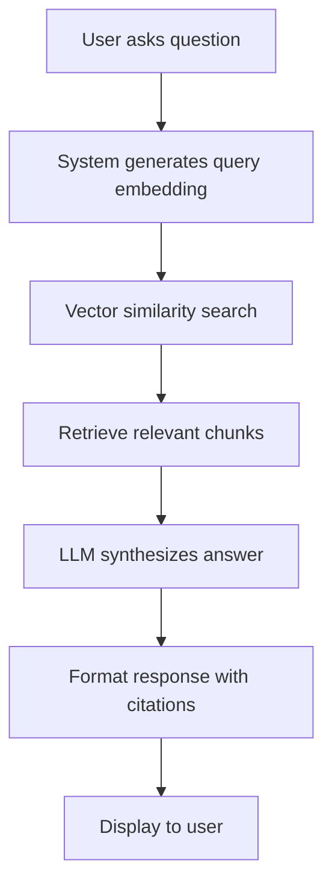
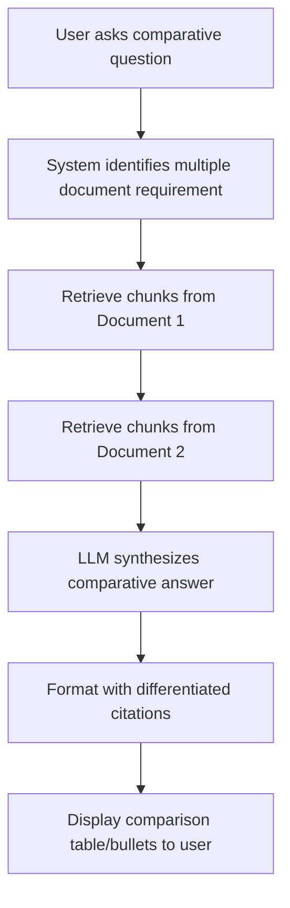
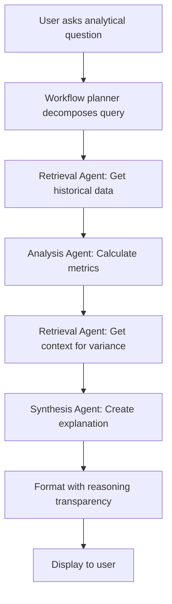
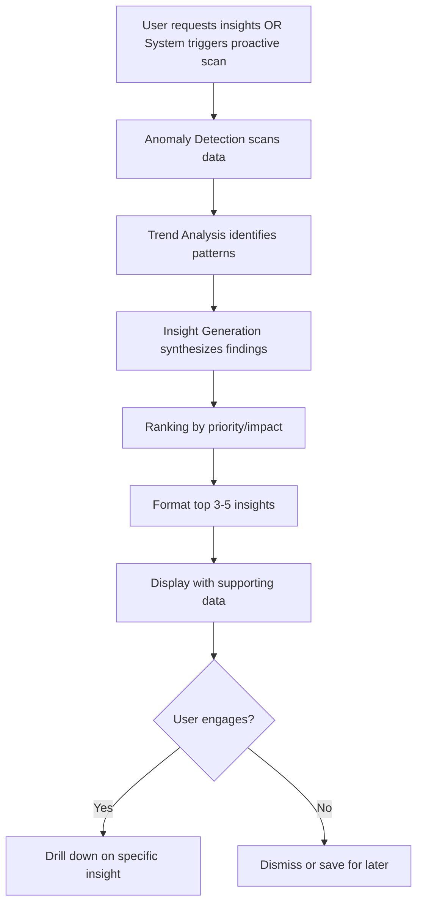
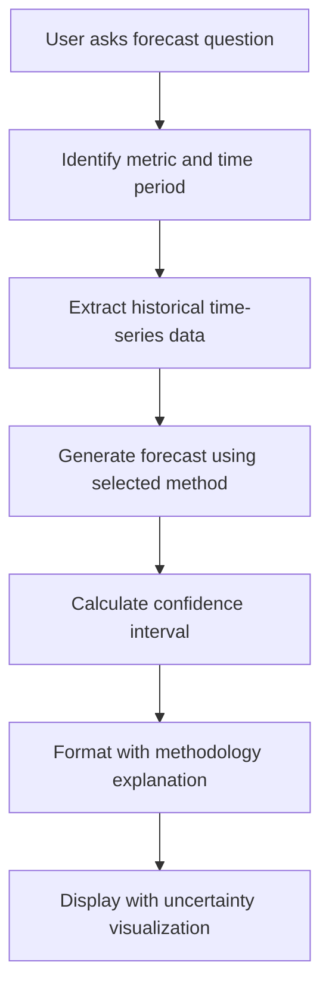

# Conversational Flow Patterns

## User Flow: Simple Factual Query

**User Goal:** Get specific financial information quickly

**Entry Points:** User asks direct question in MCP client (e.g., "What was Q3 revenue?")

**Success Criteria:** User receives accurate answer with source citation in <5 seconds

**Flow Diagram:**

**Edge Cases & Error Handling:**
- **Ambiguous query:** System asks clarification ("Which quarter did you mean? Q3 2023 or Q3 2024?")
- **No relevant data found:** System explains what's missing and suggests alternatives
- **Multiple valid answers:** System presents options or asks for specificity

**Notes:** This is the most common flow (60-70% of queries). Response format must be concise and citation-forward.

---

## User Flow: Multi-Document Synthesis

**User Goal:** Compare information across multiple time periods or entities

**Entry Points:** User asks comparative question (e.g., "Compare Q2 vs Q3 marketing spend")

**Success Criteria:** User receives clear comparison with sources for each data point

**Flow Diagram:**

**Edge Cases & Error Handling:**
- **Missing document:** System indicates which comparison is incomplete and explains why
- **Inconsistent metrics:** System flags and explains discrepancies across documents
- **Too many entities:** System limits to top 3-5 most relevant or asks user to narrow scope

**Notes:** Response must clearly differentiate sources for each data point. Consider using structured formats (tables, bullet comparisons) for clarity.

---

## User Flow: Complex Analytical Workflow (Agentic)

**User Goal:** Get multi-step analysis requiring reasoning and calculation

**Entry Points:** User asks analytical question (e.g., "Calculate YoY revenue growth and explain variance")

**Success Criteria:** User receives comprehensive analysis with reasoning steps visible in <30 seconds

**Flow Diagram:**

**Edge Cases & Error Handling:**
- **Workflow timeout:** Fallback to simpler retrieval with partial answer
- **Agent failure:** Graceful degradation with error explanation
- **Data gaps:** Identify what's missing and explain impact on analysis

**Notes:** Users should see what the system is doing ("Analyzing Q3 2023 data...", "Calculating variance...") for transparency. If workflow fails, provide partial results rather than complete failure.

---

## User Flow: Proactive Insight Discovery

**User Goal:** Learn what's important without knowing what to ask

**Entry Points:** User requests insights (e.g., "What should I know about Q3?" or system volunteers insights)

**Success Criteria:** User receives 3-5 prioritized insights with supporting data and 75%+ rated useful

**Flow Diagram:**

**Edge Cases & Error Handling:**
- **No significant insights:** Confirm all metrics are within expected ranges rather than "nothing to report"
- **Overwhelming insights:** Limit to top 5, allow filtering by category (risks, opportunities, anomalies)
- **False positives:** Provide context to help user validate insight relevance

**Notes:** Insights should be actionable ("Focus on X because Y") not just informational. Include confidence indicators for predictions.

---

## User Flow: Forecast Query

**User Goal:** Understand predicted future performance

**Entry Points:** User asks predictive question (e.g., "What's the revenue forecast for Q4?")

**Success Criteria:** User receives forecast with confidence interval and methodology explanation

**Flow Diagram:**

**Edge Cases & Error Handling:**
- **Insufficient historical data:** Explain minimum data requirements and provide available partial forecast
- **High uncertainty:** Clearly communicate wide confidence intervals and reasons
- **Forecast update needed:** Indicate when forecast was last updated and if new data is available

**Notes:** Always include confidence interval (e.g., "±15%") and explain basis ("based on 6 months historical trend"). Forecasts should feel like informed predictions, not guarantees.

---
